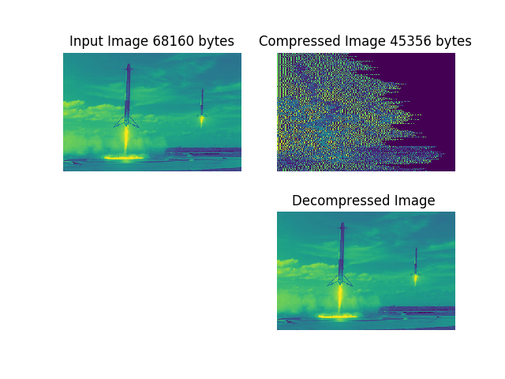

# compressingit


An algorithm that will compress a given data buffer of bytes.

Restrictions:
1. The data_ptr will point to an array of bytes. Each byte will contain a number from 0 to 127 (0x00 to 0x7F). 
   It is common for the data in the buffer to have the same value repeated in the series.
2. Lossless decompression 


## install

```
pip install -r requirements.txt
```

### c
 
#include <byte_encoder.h>


## testing

build it using
```make```

run c tests
``` ./bc_compress```

run python tests
```nosetests -v```


## usage

```
data_ptr[] = { 0x03, 0x74, 0x04, 0x04, 0x04, 0x35, 0x35, 0x64, 0x64, 0x64, 0x64, 0x00};
uint16_t new_size = byte_compress( data_ptr, sizeof(data_ptr) );
```

## results

c-implementation



python-implementation with optimization


## license

GNU GENERAL PUBLIC LICENSE v2

